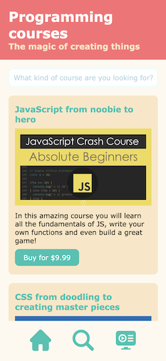
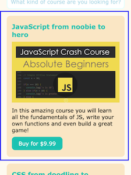
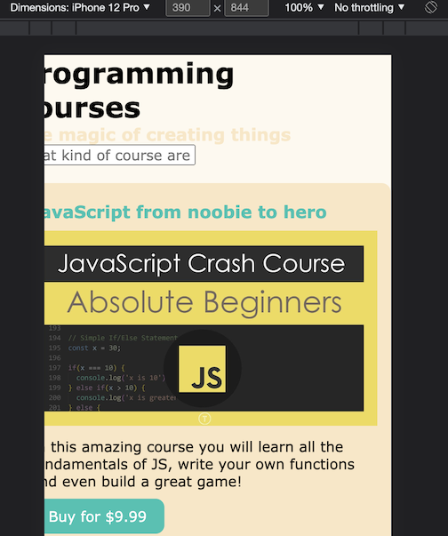
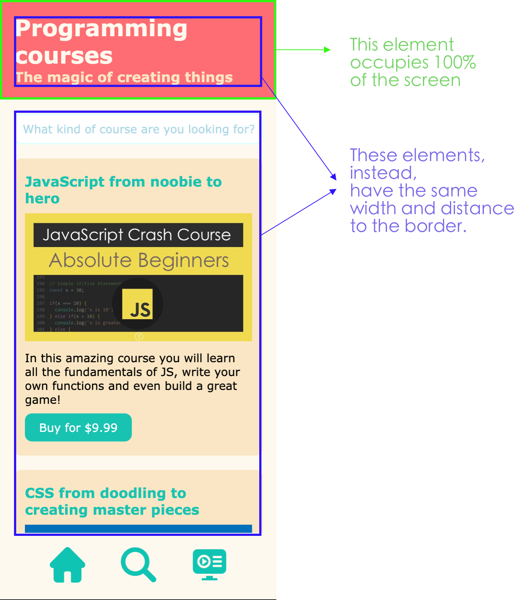
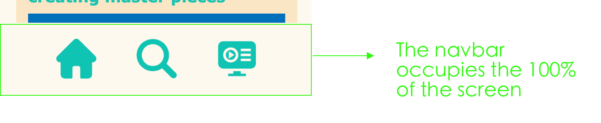

# CSS challenge #1 📱 The mobile basic layout

When learning CSS, the most difficult thing is not usually which CSS selectors and properties to apply, but to know **which elements do we apply them to**. 

One of the most beneficial things is to learn which HTML containers to create and how to group the elements in order to make the styling as easier as possible. 

> ⚠️ Note: there are **many** ways to style layouts. This is NOT the only correct way, in fact, there are really advanced techniques for pretty much anything. This will focus on using simple CSS features that you have already seen.

Today we will recreate a really basic mobile layout. We will NOT be doing it responsive (yet):



Observe 👀:
- The navbar is sticked to the end of the page (even when the user is scrolling down)
- All the elements on the page have the SAME width and space to the border. It looks homogeneous.

---

## What's in the code?

- Basically, a bunch of HTML elements and cards that are not grouped yet. You will fix that later.
- Some basic CSS styling. We have introduced *CSS variables*, a really interesting technique that you will learn today.

In CSS, we can create variables just like in JavaScript. Why? Because writing stuff like "#17c3b2" all the time is really hard to remember, or at least harder than remembering "blue".

### How do we create variables?

```css

/* In the root of the page, you create them, as many as you want, with the following syntax: */
:root {
  --primary-blue: #17c3b2;
  --primary-orange: #fe6d73;
}

/* And then you can use them in anyplace where you would use a color */
h1 {
  color: var(--primary-blue);
}

/* That's it! */

```

⚠️ You **don't** have to create any more variables in this project, but you will use the ones given to you.

---

## Iteration 1: The cards

Let's think about the final result we want:



- The card has backgrund-color
- The card image occupies the 100% of its parent (the card itself)
- The card has some padding
- The card has rounded corners (border-radius)
- Card has space between itself and the elements on top (margin)

```css
article.card {
  background-color: var(--primary-orange);
  width: 100%;
  padding: 20px 15px;
  border-radius: 10px;
  margin-top: 20px;
}
```

- The card's image of the card should occupy the 100% of its parent (the card itself), and should have some margin with the parents above and underneath (margin top and bottom) so that we can read the text comfortably:

```css
article.card>img {
  width: 100%;
  margin: 10px 0;
}
```

- the card's button also has some colors, border-radius and padding to make it prettier:
```css
article.card>button {
  background-color: var(--primary-blue);
  color: white;
  border: none;
  padding: 10px 20px; 
  margin-top: 10px;
  border-radius: 10px;
}
```
The card looks much nicer, but we have a problem ⚠️: if you inspect the webpage with Chrome dev tools, you will see that we have to scroll right to see the whole content (so the cards are not 100%, but actually a little more). That's because (and pay attention, because this is a biggie): **HTML and CSS by default add the values of width, padding, and margin**. So if we way: width 100px, and padding of 20px, the final result is width of 120px. 



But we don't want that, we want that if we say "width: 100px", the final width be 100px. And if we add some padding, it should **substract** the padding from the whole width of the element. We have a property for that. Add, in the universal selector (*), the following property:

```css
* {
  margin: 0;
  padding: 0;
  font-size: 16px;
  font-family: Verdana, Geneva, Tahoma, sans-serif;
  /* Add this: */
  box-sizing: border-box; /* You should always have this line in your code */
}
```

Now check the webpage in the browser and see the difference: we don't need to scroll left or right to see the content. 

The content is still touching the borders of the screen, we'll handle that now.

---

## Iteration 2: The layout container

Let's take a moment to think about the final result we want (that we have in our previous design):



We see that some elements have the same width and distance. We will use a container, and we will reuse that container all the time in our app to make sure it feels homogeneous and nice.

- First lets add the <code>container</code> to the HTML, in the two places we will need it:

```html
    <div class="container">
      <h1>Programming courses</h1>
      <h3>The magic of creating things</h3>
    </div>
  ````
```html
    <div class="container"><!-- We encapsulate the form and the cards in the container-->

      <form action="/search" method="GET">
      </form>

      <article class="card">
      </article>

      <article class="card">
      </article>

      <article class="card">
      </article>

      <article class="card">
      </article>

  </div><!-- End container -->
```

Now that our elements are nicely encapsulated, let's add the CSS:
```css
div.container {
  width: 100vw;
  padding: 20px;
}
```

Looking better now?

---
## Iteration 3: The navbar

Navbars are usually composed of lists, because it makes them very accessible to people browsing through a screen reader (blind, etc.). But that doesn't mean we WANT the list styles, so let's get rid of them:

Let take a second and think about the final result we want and let's add the code:



- The navbar occupies the 100% of the window and has 20px of padding. The background is the "basic white" color.

```css
nav {
  width: 100vw; /* Remember viewport width? */
  padding: 20px;
  background-color: var(--basic-white);
}
```

- The list (NOT the list items, NOT the nav, the LIST) **should not have the list default bullets**.
- The list ITEMS should be nicely spread through the navbar. We will use <code>display:flex;</code> for that. Remember that, when we want something *flexed*, we have to apply it to the PARENT element.

```css
nav ul {
  list-style-type: none;
  display: flex;
  justify-content: space-evenly;
}
```

- The icons of the navbar should have 50px of width.

```css
nav ul li a img { /* The more specific the selector, the better */
  width: 50px;
}
```

- And now the hard part. We want the navbar sticked to the bottom of the page. We can use <code>position: sticky</code> for that:

```css
nav {
  width: 100vw;
  padding: 20px;
  background-color: var(--basic-white);
  /* Add: */
  position: sticky; /* Sticky stays even when you scroll */
  bottom: 0; /* Right at the bottom of the page, 0 pixels */
}
```

Check the result and scroll down. What would be the difference if we used <code>position: absolute</code>? Try and see.

---
## Iteration 4: Final touches

### The input styles

We have a search bar that looks a little ugly with the default styles. Let's add some styles:

```css
form>input.search-input {
  width: 100%; /* 100% of the parent, which is our new container */
  padding: 10px;
  border-radius: 10px;
  border: 2px solid var(--light-blue);
}

form>input.search-input::placeholder {
  color: var(--light-blue);
}
```

### The header

Now let's think for a second:


